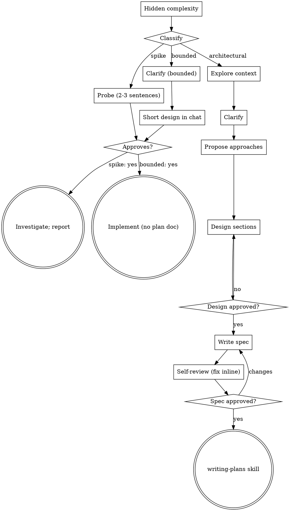

# Brainstorming — Full Checklists & Process Flow

Detailed reference for the Architectural path and the full process
flow diagram. Spike and Bounded checklists stay inline in SKILL.md —
they're short and used on nearly every request. Load this file when
running the Architectural path or when the flow diagram helps clarify
branching/terminal states.

## Architectural Checklist (Full)

| # | Step |
|---|------|
| 1 | Explore context, files, docs, recent commits |
| 2 | Offer visual companion just-in-time (own message, only when clearer shown) — approval opens browser tab, see Visual Companion in SKILL.md |
| 3 | Ask clarifying questions one at a time: purpose, constraints, success criteria; multiple choice preferred |
| 4 | Propose 2-3 approaches, trade-offs + recommendation, leading with it; YAGNI ruthlessly |
| 5 | Present design in sections scaled to complexity (sentences to 200-300 words), approval after each: architecture, components, data flow, errors, testing |
| 6 | Write design doc to `docs/superpowers/specs/YYYY-MM-DD-<topic>-design.md` (user location overrides), commit |
| 7 | Spec self-review inline: placeholders/TBD, contradictions, scope, ambiguity (pick one reading, make explicit); fix inline, no re-review |
| 8 | User reviews written spec — "Spec written and committed to `<path>`. Review and flag changes before implementation plan." Wait; changes → fix step 7 |
| 9 | Invoke writing-plans skill, no other skill |

## Process Flow

Terminal states path-bound: architectural ends at writing-plans only;
bounded ends at normal dev workflow; spike ends at reported
recommendation.
