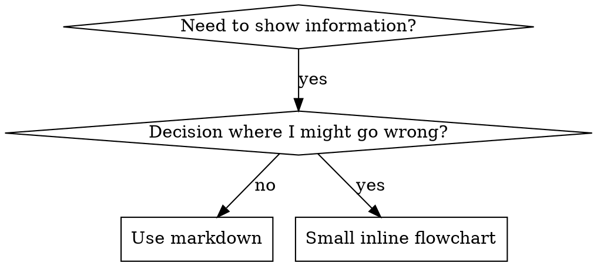

# Writing Skills

## Overview

**Writing skills IS TDD applied to process documentation.** A skill = reference guide for proven technique/pattern/tool, reusable, helps future agents find/apply effective approaches. NOT a narrative about solving a problem once.

**Personal skills live in runtime's skills dir** (`~/.claude/skills/` on Claude Code, see [codex-tools.md](../using-superpowers/references/codex-tools.md) / [gemini-tools.md](../using-superpowers/references/gemini-tools.md) for other runtimes; Codex/Copilot CLI/Gemini CLI also recognize `~/.agents/skills/`).

**Core principle:** didn't watch agent fail w/o skill? Don't know if skill teaches right thing.

| TDD | Skill Creation |
|---|---|
| Test case | Pressure scenario w/ subagent |
| Production code | Skill doc (SKILL.md) |
| RED | Agent violates rule w/o skill (baseline), rationalizations documented verbatim |
| GREEN | Agent complies w/ skill present |
| Refactor | Close loopholes, keep compliance |

## When to Create a Skill

**Create when:** technique wasn't obvious to you, you'd reference again, pattern applies broadly, others benefit. **Don't:** one-off solutions, standard practices documented elsewhere, project-specific conventions (instructions file instead), mechanical constraints (automate, don't document).

**Types:** Technique (steps: condition-based-waiting), Pattern (mental model: flatten-with-flags), Reference (API/syntax docs: office docs).

## Directory Structure

```
skills/
  skill-name/
    SKILL.md              # required
    supporting-file.*     # only if needed
```

Flat namespace. Separate files for heavy reference (100+ lines) or reusable tools (scripts, templates). Keep principles, concepts, code <50 lines inline.

## SKILL.md Structure

**Frontmatter:** required `name`, `description` (see [spec](https://agentskills.io/specification)). Max 1024 chars total. `name`: letters/numbers/hyphens only. `description`: third-person, only when-to-use not what it does, start "Use when...", specific symptoms, never summarize process, under 500 chars if possible.

```markdown
---
name: Skill-Name-With-Hyphens
description: Use when [specific triggering conditions and symptoms]
---
# Skill Name
## Overview      — core principle, 1-2 sentences
## When to Use    — symptoms, use cases, when NOT to use; small flowchart only if non-obvious
## Core Pattern   — before/after code comparison (technique/pattern skills)
## Quick Reference — table/bullets for scanning
## Implementation — inline code, or link to file for heavy reference/tools
## Common Mistakes — what goes wrong + fixes
## Real-World Impact (optional)
```

## Skill Discovery Optimization (SDO)

Future agents must FIND your skill.

**Description = When to Use, NOT What Skill Does.** Summarizing workflow makes agents follow description instead of full skill — tested: "code review between tasks" made agent do ONE review though skill's flowchart specified TWO. Trim to pure trigger condition. Concrete triggers/symptoms; describe *problem* (race conditions) not *language-specific symptom* (setTimeout); tech-agnostic unless skill is tech-specific; third person.

```yaml
# ❌ summarizes workflow
description: Use when executing plans - dispatches subagent per task with code review between tasks
# ✅ triggering conditions only
description: Use when executing implementation plans with independent tasks in the current session
```

**Keywords:** words an agent would search — error messages ("Hook timed out", "ENOTEMPTY"), symptoms ("flaky", "hanging", "zombie"), synonyms ("timeout/hang/freeze"), tools/commands. **Naming:** active voice, verb-first — `creating-skills` not `skill-creation`.

**Token efficiency:** getting-started/frequently-loaded skills load into EVERY conversation. Targets: getting-started <150 words, frequently-loaded <200, others <500 (`wc -w skills/path/SKILL.md`). Reference `--help` instead of documenting flags; cross-reference other skills instead of repeating workflow; one minimal example.

**Cross-referencing:** skill name w/ requirement markers — ✅ `**REQUIRED SUB-SKILL:** Use superpowers:brainstorming` / ❌ `See skills/testing/some-skill` (unclear if required) / ❌ `@skills/testing/some-skill/SKILL.md` (force-loads, burns 200k+ context).

## Flowchart Usage



**Use ONLY for:** non-obvious decisions, loops you might stop too early, "A vs B". **Never for:** reference material, code examples, linear instructions, labels w/o semantic meaning.

## Code Examples

One excellent example beats many mediocre ones. Pick relevant language (testing → TS/JS, debugging → Shell/Python, data → Python). Complete/runnable, comments explain WHY, from real scenario, ready to adapt not generic template. Don't implement in 5+ languages or write contrived fill-in-blank examples — you're good at porting.

## The Iron Law (Same as TDD)

```
NO SKILL WITHOUT A FAILING TEST FIRST
```

Applies to NEW skills AND EDITS. Wrote/edited before testing? Delete it, start over. No exceptions for "simple additions" or "documentation updates". Don't keep untested changes as "reference", don't "adapt" while running tests. Delete means delete.

## Testing All Skill Types

| Type | Examples | Test with | Success |
|---|---|---|---|
| Discipline-enforcing | systematic-debugging, brainstorming | academic Qs, pressure scenarios, combined pressures, rationalizations → counters | Follows rule under max pressure |
| Technique | condition-based-waiting, root-cause-tracing | application, edge cases, missing-info gaps | Applies technique to new scenario |
| Pattern | reducing-complexity, information-hiding | recognition, application, counter-examples | Identifies when/how to apply |
| Reference | office docs | retrieval, application, gap testing | Finds and applies info |

## Match the Form to the Failure

Classify baseline failure before writing guidance — form that bulletproofs one failure type backfires on another (e.g. prohibitions fix rule-violation-under-pressure but backfire on wrong-shape-output). Failure-type → form table, prohibition pitfalls, nuance/exemption-clause traps: [references/match-form-to-failure.md](references/match-form-to-failure.md).

## Micro-Test Wording Before Full Scenarios

Full pressure-scenario runs are final gate but slow/expensive per iteration. Verify wording first: one fresh-context sample per call (raw API call or single-shot subagent; system prompt = realistic full-skill context not guidance alone; user message = task tempting failure). Always include no-guidance control — doesn't fail? nothing to fix. 5+ reps/variant, single samples lie. Manually read every flagged match — echoes/quoted counter-examples masquerade as hits. Variance is a metric: reps converging = guidance landed; scattered interpretations = wording not binding, tighten before adding words. Doesn't replace pressure scenarios.

**Testing methodology, condensed:** pressure-test skill on fresh subagents, one scenario per rationalization to block. Baseline w/o skill, capture verbatim excuses. Revise skill to counter each. Re-run until subagent complies w/o the loophole, incl. combined pressures (time + sunk cost + authority + exhaustion). Iterate until bulletproof.

## Anti-Patterns

**❌ Narrative example** (session-specific). **❌ Multi-language dilution** (mediocre, maintenance burden). **❌ Code in flowcharts** (`step1 [label="import fs"];` — can't copy-paste). **❌ Generic labels** (helper1, step3).

## STOP: Before Moving to Next Skill

After writing ANY skill, STOP, complete deployment process. **Do NOT** batch multiple skills w/o testing each, or skip testing because "batching is more efficient". Checklist below MANDATORY for EACH skill. Deploying untested skills = deploying untested code.

## Skill Creation Checklist (TDD Adapted)

**Create a todo for EACH item below.**

**RED:**
- [ ] Pressure scenarios (3+ combined pressures for discipline skills)
- [ ] Run WITHOUT skill — document baseline behavior verbatim
- [ ] Identify rationalization/failure patterns

**GREEN:**
- [ ] Name: letters/numbers/hyphens only
- [ ] Frontmatter `name`+`description` (max 1024 chars; see [spec](https://agentskills.io/specification))
- [ ] Description starts "Use when...", specific triggers, third person
- [ ] Keywords throughout for search
- [ ] Overview addresses baseline failures from RED
- [ ] Guidance form matches failure type (Match the Form to the Failure)
- [ ] Behavior-shaping guidance micro-tested vs no-guidance control (5+ reps, manually read) — N/A for reference skills
- [ ] Code inline or linked; one excellent example
- [ ] Run WITH skill — verify compliance

**REFACTOR:**
- [ ] New rationalizations → explicit counters
- [ ] Rationalization table + red flags list from all iterations
- [ ] Re-test until bulletproof

**Quality:** flowchart only if non-obvious; quick reference table; common mistakes section; no narrative; supporting files only for tools/heavy reference.

**Deployment:** commit, push to fork (if configured), consider PR if broadly useful.

## Discovery Workflow

Agent finds skill: hits problem → greps descriptions → matches → scans overview → reads patterns → loads example when implementing. Put searchable terms early and often.
